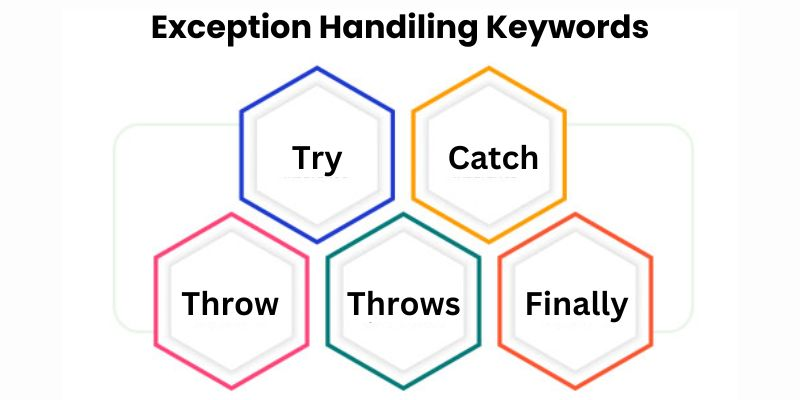

# 代码防炸秘籍：try/catch/finally



程序员日常崩溃瞬间都见过吧？接口炸了页面白花花，用户信息直接裸奔，加载圈转成永动机... 这都是没给代码穿"安全防炸套"的后果啊！（战术后仰）

今天必须把 `try catch finally` 这「保命三件套」给老铁们整明白了！

## 01 <br/> 抓狂的破事

有一天，客户现场反馈有个客户领导打开用户中心页面，页面白屏，菊花还在一直转，想要转成永动机。

经过排查，发现该该页面「实时拉取个人订单、消息通知等多维度」数据，而造成白屏现象是因为：

1. 接口超时。
2. Loading 动画状态一直未关闭。
3. JSON 解析失败引发脚本中断。
4. 敏感错误堆栈暴露到控制台。

爬出代码大致如下：

```js
// 隐患的写法
fetch('/api/user-orders')
  .then((res) => res.json()) // 风险点1
 .then((data) => render(data.list)) // 风险点2
 .catch(() => console.log('error')) // 无法捕获同步错误
```

（摔键盘）这代码就像没戴头盔骑鬼火——分分钟全村开席的节奏啊！

## 02 <br/> 保命代码的奥义

核心思想：给代码穿上三级甲！错误隔离 + 兜底操作，生死看淡不服就干！

设计原则：安全沙箱 + 状态回滚 + 资源回收。

```js
// 优化后的写法
async function fetchUserOrders() {
  let response;
  try {
    response = await fetch('/api/user-orders');
    if (!response.ok) throw new Error(`请求异常: ${response.status}`);
    const jsonData = await response.json();
    if(!jsonData?.list) throw new Error('数据结构异常');

    return processData(jsonData); // 处理数据
  } catch (error) {
      reportError(error); // 兜底操作：上报错误，错误日志发到管理猿邮箱
      showGracefulError(); // 兜底操作：展示友好错误提示：忽悠客户，系统抽风，正在殴打程序猿
      return getCacheData(); // 兜底操作：返回缓存数据

  } finally {
    dismissLoading(); // 兜底操作：关闭 Loading 动画
    cleanupResources(response); // 兜底操作：释放资源
  }
}
```

**执行流程**：`try → (成功 → finally) 或 (失败 → catch → finally)`。

**关键特性**：

- `try`：包裹高风险操作（网络请求、数据转换）。
- `catch`：
  - 支持错误类型过滤 `if(error instanceof SyntaxError)`。
  - 可重新抛出业务错误 `throw new CustomError(error)`。
- `finally`：
  - 必定执行的清理逻辑（比 `return` 优先级更高）。
  - 避免内存泄漏的终极保障。

**防坑指南**：

- 异步回调里的错误抓不到（得用 `async/await`）！
- 别写空 `catch`！错误被吞了查 bug 能查到你原地去世。
- 语法错误抓不住！（比如少写个括号，编译时就报错了）。

## 03 <br/>扩展应用场景

### 1. 表单安全校验

```js
function validateForm(input) {
  try {
    validateEmail(input.email);
    validatePhone(input.phone);
    return { isValid: true };
  } catch (error) {
    highlightErrorField(error.field);
    return { isValid: false, reason: error.message };
  }
}
```

### 2. 第三方库安全接入

```js
function initMapSDK() {
  let mapInstance;
  try {
    mapInstance = new ThirdPartyMap('#container', config);
  } catch (error) {
    console.warn('地图初始化失败，启用静态视图');
    renderStaticMap();
  } finally {
    trackSDKUsage('map'); // 无论成败都记录埋点
  }
}
```

### 3. 浏览器特性降级

```js
async function loadWebAssembly() {
  try {
    if (!window.WebAssembly) throw new Error('环境不支持');
    const module = await WebAssembly.compile(buffer);
    return initWasmModule(module);
  } catch (error) {
    console.warn('WASM加载失败，切换JS实现');
    loadJavaScriptFallback();
  }
}
```

## 04 <br/>老司机的忠告

- **错误要分类**：网络错误、后端甩锅错误、用户作死错误分开放
- **日志带上下文**：把用户 ID、贴吧 ID 塞进错误日志，甩锅必备！
- **别滥用try-catch**：简单代码别套娃，性能会拉胯！
- **监控平台接上**：`Sentry/Bugly` 装起来，错误实时警报！

```js
class AppError extends Error {
  constructor(message, type, meta) {
    super(message);
    this.type = type; // NETWORK | RUNTIME | VALIDATION
    this.meta = meta; // 设备信息/用户操作路径
    this.timestamp = new Date().toISOString();
  }
}

// 使用示例
throw new AppError('xx请求超时', 'NETWORK', {
  userId: 'U123456',
  paymentMethod: 'xxPay'
});
```

## 作者说

（点烟总结）这波操作下来，代码稳如吧务删帖，错误处理骚如吧友对线。记住：try是冲锋，catch是撤退，finally是打扫战场，三者配合才能让代码在贴吧的腥风血雨中活下来！奥利给就完事了！

打广告：作者常以「江湖聊IT」为名混迹于技术圈，创有：[博客](https://www.fullstack.ren/)、[公众号](https://mp.weixin.qq.com/s/SCcPX66geeCfg1Eu-JGmcg)、[掘金](https://juejin.cn/user/1046390799881463)、[Github](https://github.com/fullstackren/)（点个 star 鼓励下持续创作） 和[抖音](https://www.douyin.com/user/MS4wLjABAAAAra__2Du0aaHbtq2dve76uHX5MV-HaAeDiBf7wVvhHZc)。

（完，祝好~）
