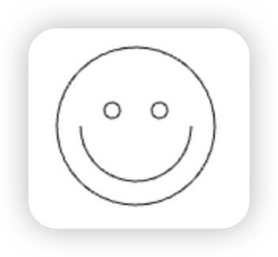

# Canvas API

Canvas API 提供了一个通过 [JavaScript](../javascript/index.md) 和 [HTML](../html/index.md) 的 `<canvas>` 元素来绘制 2D 图形的方式。

**使用场景**：可以用于**动画、游戏画面、数据可视化、图片编辑**以及**实时视频**处理等方面。

## 01 <br/>快速上手

支持宽度（`width`）和高度（`height`） 2 个属性。若没有设置宽度和高度，初始化宽度为 300 像素和高度为 150 像素。

```js
// 为 <canvas> 元素得到 DOM 对象
const canvas = document.getElementById("app");

// 获得渲染上下文和它的绘画功能
const ctx = canvas.getContext("2d");
```

## 02 <br/>语法

### 2.1 绘制图形

#### 画布栅格


画布栅格的起点为左上角（坐标为（0,0）），所有元素的位置都相对于原点定位。上图中蓝色方形左上角的坐标为距离左边（X 轴）x 像素，距离上边（Y 轴）y 像素（坐标为（x,y））。

#### 绘制矩形

1. 绘制一个填充的矩形，语法格式：`fillRect(x, y, width, height)`
2. 绘制一个矩形的边框，语法格式：`strokeRect(x, y, width, height)`
3. 清除指定矩形区域，语法格式：`clearRect(x, y, width, height)`

- x 与 y 指定了在 canvas 画布上所绘制的矩形的左上角（相对于原点）的坐标。
- width 和 height 设置矩形的尺寸。

**示例**：绘制一个空心正方形：


```js
function draw() {
  const canvas = document.getElementById("canvas");
  if (canvas.getContext) {
    const ctx = canvas.getContext("2d");

    ctx.fillRect(25, 25, 100, 100);
    ctx.clearRect(45, 45, 60, 60);
    ctx.strokeRect(50, 50, 50, 50);
  }
}
```

#### 绘制路径

图形的基本元素是路径。路径是通过不同颜色和宽度的线段或曲线相连形成的不同形状的点的集合。路径步骤：

1. 创建路径起始点。
   - `beginPath()`，图形绘制命令被指向到路径上生成路径。
2. 使用画图命令去画出路径。
   - `moveTo(x, y)` 将笔触移动到指定的坐标 x 以及 y 上，不能画出任何东西。
3. 封闭路径。
   - `closePath()`，图形绘制命令又重新指向到上下文中。
4. 通过描边或填充路径区域来渲染图形。
   - `stroke()` 线条来绘制图形轮廓，不会自动闭合。
   - `fill()` 填充路径的内容区域生成实心的图形，会自动闭合。

**示例**：绘制一个三角形：





:::code-group

```js [三角形]
function draw() {
  const canvas = document.getElementById("canvas");
  if (canvas.getContext) {
    const ctx = canvas.getContext("2d");

    // 创建路径起始点
    ctx.beginPath();
    ctx.moveTo(75, 50);
    ctx.lineTo(100, 75);
    ctx.lineTo(100, 25);
    ctx.fill();
  }
}
```

```js [设置笔触移动笑脸]
function draw() {
  const canvas = document.getElementById("canvas");
  if (canvas.getContext) {
    const ctx = canvas.getContext("2d");

    ctx.beginPath();
    ctx.arc(75, 75, 50, 0, Math.PI * 2, true); // 绘制
    ctx.moveTo(110, 75);
    ctx.arc(75, 75, 35, 0, Math.PI, false); // 口 (顺时针)
    ctx.moveTo(65, 65);
    ctx.arc(60, 65, 5, 0, Math.PI * 2, true); // 左眼
    ctx.moveTo(95, 65);
    ctx.arc(90, 65, 5, 0, Math.PI * 2, true); // 右眼
    ctx.stroke();
  }
}
```

```js [不设置笔触移动笑脸]
function draw() {
  const canvas = document.getElementById("canvas");
  if (canvas.getContext) {
    const ctx = canvas.getContext("2d");

    ctx.beginPath();
    ctx.arc(75, 75, 50, 0, Math.PI * 2, true); // 绘制
    // ctx.moveTo(110, 75);
    ctx.arc(75, 75, 35, 0, Math.PI, false); // 口 (顺时针)
    // ctx.moveTo(65, 65);
    ctx.arc(60, 65, 5, 0, Math.PI * 2, true); // 左眼
    // ctx.moveTo(95, 65);
    ctx.arc(90, 65, 5, 0, Math.PI * 2, true); // 右眼
    ctx.stroke();
  }
}
```

:::

使用样式与颜色
绘制文本
使用图像
变形
合成和剪辑
基本动画
高级动画
像素处理
优化 canvas
终曲


获取 HTML `<canvas>` 元素的引用。

## 兼容性

由于某些较老的浏览器（**尤其是 IE9 之前的 IE 浏览器**）或者文本浏览器不支持 HTML 元素"canvas"，在这些浏览器上你应该总是能展示替代内容。可通过 `getContext()` 方法来检测浏览器是否支持 canvas。

```js
const canvas = document.getElementById("tutorial");

if (canvas.getContext) {
  const ctx = canvas.getContext("2d");
  // drawing code here
} else {
  // canvas-unsupported code here
}
```